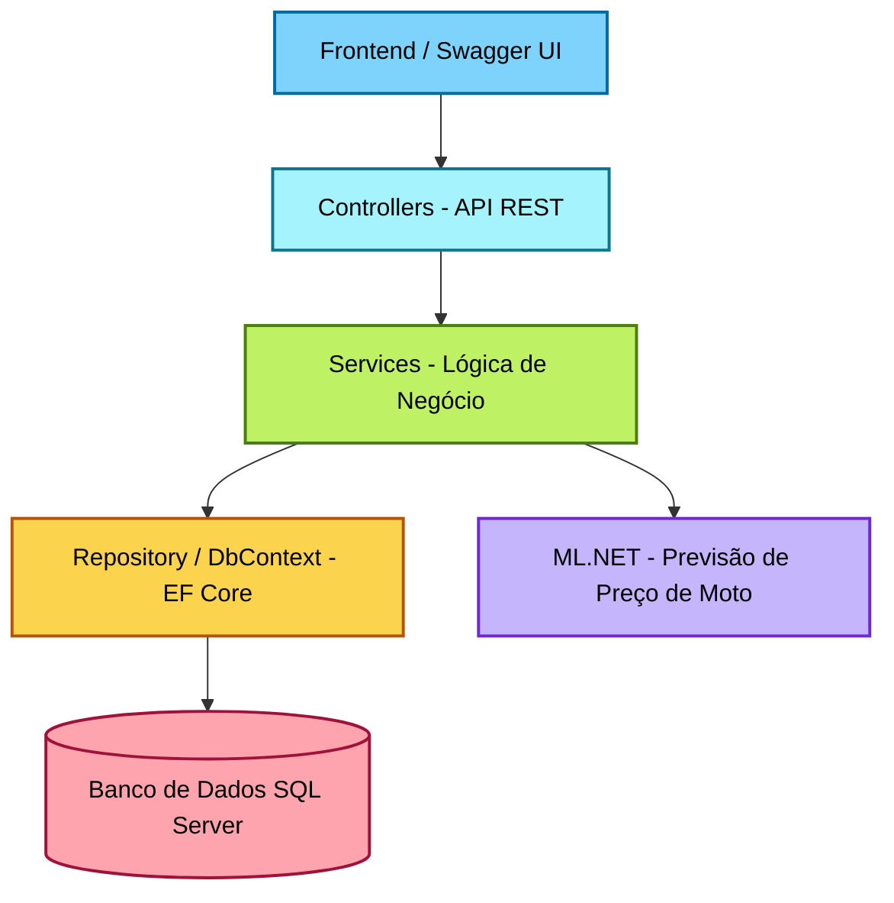
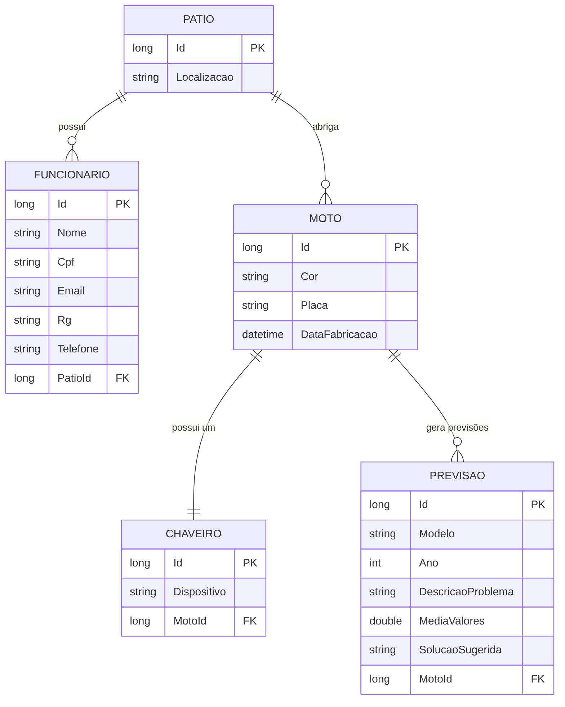

# MotoBlu API

A **MotoBlu API** é uma aplicação desenvolvida em **.NET 9 (ASP.NET Core Web API)** com integração ao banco de dados **Oracle**.  
O projeto tem como objetivo fornecer um sistema completo para o gerenciamento de motocicletas, clientes e serviços, adotando boas práticas REST, segurança, versionamento e testes automatizados.

---

## Etiquetas

[](https://dotnet.microsoft.com/)
[](https://choosealicense.com/licenses/mit/)
[](https://www.oracle.com/database/)
[](https://swagger.io/)
[](https://xunit.net/)

---

## Demonstração

A API pode ser testada via **Swagger UI**, acessando:

https://localhost:5051/swagger

---

## Funcionalidades

- CRUD completo de Clientes, Motos e Serviços
- Integração com banco de dados Oracle via **Entity Framework Core**
- Versionamento de API
- Endpoint de Health Check
- Segurança via **JWT Authentication**
- Endpoint com **ML.NET** para previsão de manutenção
- Testes unitários e de integração com **xUnit**
- Documentação interativa com **Swagger**

---

## Documentação

A documentação interativa está disponível via **Swagger UI**, contendo:
- Descrição completa dos endpoints
- Exemplos de requisições e respostas
- Modelos de dados e parâmetros
- Status codes adequados

---

## Instruções de Execução: 
- Clonar o repositório
```bash
    git clone https://github.com/HeitorOrtega/Sprint.NET.git
    cd sprint
```

---

## Restaurar dependências
```bash
dotnet restore
```

---

## Configuração do Banco de Dados/Configure o appsettings.json:
- Edite o arquivo appsettings.json as credenciais:
  
```json  
    "ConnectionStrings": {
        "OracleConnection": "User Id=rm557825;Password=fiap25;Data Source=oracle.fiap.com.br:1521/ORCL;"
}
```

---

## Criação do Banco e Migrations:

```bash
    dotnet ef database update
```

---

## Execução do Projeto:

```bash
    dotnet run
```

---

## Acesse no navegador:
    http://localhost:5051/swagger

---

## Endpoints Principais
### Funcionário
| Método | Endpoint                    | Descrição                         | Status Code |
| ------ | --------------------------- | --------------------------------- | ----------- |
| GET    | `/api/v1/funcionarios`      | Lista todos os funcionários       | 200         |
| GET    | `/api/v1/funcionarios/{id}` | Retorna um funcionário por ID     | 200 / 404   |
| POST   | `/api/v1/funcionarios`      | Cria um novo funcionário          | 201         |
| PUT    | `/api/v1/funcionarios/{id}` | Atualiza um funcionário existente | 200 / 404   |
| DELETE | `/api/v1/funcionarios/{id}` | Remove um funcionário             | 204 / 404   |

---

### Moto
| Método | Endpoint             | Descrição                  | Status Code |
| ------ | -------------------- | -------------------------- | ----------- |
| GET    | `/api/v1/motos`      | Lista todas as motos       | 200         |
| GET    | `/api/v1/motos/{id}` | Retorna uma moto por ID    | 200 / 404   |
| POST   | `/api/v1/motos`      | Cadastra uma nova moto     | 201         |
| PUT    | `/api/v1/motos/{id}` | Atualiza dados de uma moto | 200         |
| DELETE | `/api/v1/motos/{id}` | Remove uma moto            | 204         |

---

### Patio
| Método | Endpoint              | Descrição                   | Status Code |
| ------ | --------------------- | --------------------------- | ----------- |
| GET    | `/api/v1/patios`      | Lista todos os pátios       | 200         |
| GET    | `/api/v1/patios/{id}` | Retorna um pátio específico | 200 / 404   |
| POST   | `/api/v1/patios`      | Cadastra um novo pátio      | 201         |
| PUT    | `/api/v1/patios/{id}` | Atualiza um pátio           | 200         |
| DELETE | `/api/v1/patios/{id}` | Remove um pátio             | 204         |

---

### Previsão (ML.NET)
| Método | Endpoint           | Descrição                                                | Status Code |
| ------ | ------------------ | -------------------------------------------------------- | ----------- |
| POST   | `/api/v1/previsao` | Retorna uma previsão de manutenção para a moto informada | 200         |

---

### Health Check
| Método | Endpoint           | Descrição                                                | Status Code |
| ------ | ------------------ | -------------------------------------------------------- | ----------- |
| POST   | `/api/v1/previsao` | Retorna uma previsão de manutenção para a moto informada | 200         |

---

## Versionamento da API

- A API utiliza versionamento via URL:

#### v1: CRUD e endpoints principais e integração com ML.NET

#### v2: Recursos adicionais e melhorias 

---

## Segurança

- A autenticação é baseada em API KEY:
    ```bash
     "ApiKeySettings": {
      "Key": "12345-API-KEY-MOTOBLU"
    }
    ```
    
---

## Testes:
- Execute os testes unitários e de integração:
```bash
    dotnet test
```

## Chagelog do meu projeto da Mottu

### Sprint 1 e Sprint 2

- Criação inicial do projeto MotoBlu API em .NET 8 (Web API)

- Estrutura base da solução com integração ao Oracle Database via EF Core

- Implementação dos primeiros endpoints CRUD

- Configuração do Swagger/OpenAPI para documentação

- Refinamento do CRUD e inclusão de status codes adequados (200, 201, 204, 400, 404)

- Parametrização das rotas com QueryParams e PathParams

- Configuração do README.md inicial com instruções básicas

- Organização do repositório GitHub e documentação

### Sprint 3

- Definição das entidades principais (Funcionário, Moto, Pátio)

- Reestruturação da arquitetura com camadas Controller, Service e Repository

- Implementação de HATEOAS e paginação nos endpoints

- Melhoria da documentação Swagger com exemplos e modelos de dados

- Adição de instruções de execução e comandos de teste no README

### Sprint 4

- Implementação do versionamento da API (v1/v2)

- Criação do endpoint de Health Check

- Adição da autenticação JWT

- Implementação de endpoint de previsão com ML.NET

- Desenvolvimento de testes unitários e de integração (xUnit + WebApplicationFactory)

Inclusão de diagramas de arquitetura e ERD no README

Revisão final seguindo boas práticas REST e HTTP

---

# Diagramas 

## Diagrama da Arquitetura 

---

#### Explicação da Arquitetura

- Controller Layer: Define endpoints HTTP e valida parâmetros.

- Service Layer: Regras de negócio e orquestração entre entidades.

- Repository Layer: Manipulação de dados via Entity Framework Core.

- ML.NET Prediction Engine: Processa os dados de motos para prever manutenções.

- Oracle Database: Armazena todas as entidades persistentes.

- JWT Authentication: Garante a segurança das rotas protegidas.

- Swagger: Interface gráfica da documentação da API.
  
---

## Diagrama Entidade-Relacionamento (ERD)

#### Explicação da Arquitetura

- Pátio: Entidade central que representa o local físico onde motos e funcionários estão vinculados.

- Funcionário: Associado a um pátio específico. Cada funcionário pode gerenciar várias motos.

- Moto: Pode estar associada a um ou mais pátios e possui um chaveiro (1:1).

- Chaveiro: Dispositivo de segurança vinculado a uma única moto.

- Previsão (ML.NET): Entidade auxiliar usada para prever falhas ou manutenções com base nos dados de entrada (modelo, ano, descrição do problema etc.).


👥 Autores

Equipe MotoBlu

Heitor Ortega Silva - 557825

Pedro Cardoso Saraiva - 555160

Marcos Lourenço - 556496

Curso: Análise e Desenvolvimento de Sistemas - FIAP

